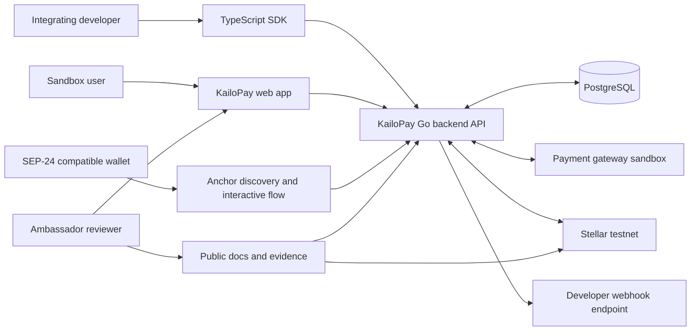

# Backend Architecture

## 1. Architecture decision

KailoPay `v0.1.0` should be built as a **modular monolith** in Go with one PostgreSQL database. HTTP endpoints and background workers may run as separate processes from the same codebase, but share domain modules and persistence contracts.

This approach is recommended because the SOW assumes one full-stack developer and a 30-day delivery window. It preserves clear boundaries without adding service discovery, distributed deployment, or cross-service consistency work.

Microservices are a Future option only after independently scaling or regulated operational boundaries justify them.

## 2. System context



The TypeScript SDK is an external client package, not a backend module or deployable process. It depends only on the public API/OpenAPI contract and must not import or duplicate Go domain logic.

## 3. Deployable processes

| Process | Responsibility | Scaling unit |
|---|---|---|
| `api` | REST API, SEP-24 endpoints, gateway callbacks, federation, liveness/readiness/startup probes | Stateless HTTP replicas; one is sufficient for sandbox |
| `worker` | Outbox consumption, payment processing, Stellar submission/reconciliation, developer webhook delivery | One process initially; jobs use database leases |
| `automigrate` | Local/test schema bootstrap using GORM `AutoMigrate` | One-shot local/test command |
| `migrate` | Future reviewed/versioned PostgreSQL migrations for shared environments | One-shot deployment job |

The web frontend is a separate deliverable and communicates only through public/backend contracts.

## 4. Logical modules

| Module | Owns | May depend on |
|---|---|---|
| `identity` | API clients, test-key issuance/revocation, authentication context | Shared crypto/time abstractions, persistence |
| `orders` | Quotes, orders, state transitions, order event history, orchestration commands | Payment and Stellar ports, outbox, persistence |
| `payments` | Gateway checkout, callback normalization/verification, payout request and reconciliation | Selected provider adapter, orders port |
| `stellar` | Testnet accounts, asset transfer/issuance, deposit verification, retirement, transaction reconciliation | Stellar SDK adapter, orders port |
| `anchor` | SEP-24 interactive deposit/withdrawal, KYC stub, `stellar.toml`, federation | Orders application usecases |
| `developer_webhooks` | Endpoint registration, event envelope, signing, attempts, retries | Outbox, orders event feed |
| `evidence` | Test/evidence references and sanitized export helpers | Read-only access to order/integration metadata |
| `platform` | Configuration, database, logging, metrics, clock, IDs, and crypto plumbing | External libraries only |

Modules communicate through application interfaces and domain IDs. Provider SDK objects and database rows must not leak into the domain model or public API schemas.

## 5. Suggested source layout

```text
cmd/
  api/main.go
  worker/main.go
  automigrate/main.go
internal/
  entity/
  handler/http/
  handler/middleware/
  usecase/
  repository/
  adapter/<provider>/
  platform/
    config.go
    database.go
    logging.go
migrations/
openapi/
```

The Go layout follows package ownership rather than framework layers. A use
case declares only the small interfaces it consumes; concrete GORM repositories
and provider adapters implement those interfaces. GORM row models stay inside
the persistence adapter. Avoid generic `utils`, `services`, or `interfaces`
packages.

Do not create generic `utils` or `services` dumping grounds. Shared code must have a stable, narrow purpose and no dependency on feature modules.

## 5.1 Reference alignment

The current master of [`bxcodec/go-clean-arch`](https://github.com/bxcodec/go-clean-arch)
is useful as a Go-specific reference because it evolved toward consumer-owned
interfaces, `internal` packages, and usecase-focused capability files. KailoPay
adopts those principles while keeping names that match this product's agreed
Clean Architecture vocabulary:

| Reference concept | KailoPay layout | Reason |
|---|---|---|
| `domain` | `internal/entity` | Business entities are private to this application, not a public library. |
| Feature usecase file | `internal/usecase/<capability>_usecase.go` | Each capability owns its workflow and the small ports it consumes without an extra capability folder. |
| `internal/rest` | `internal/handler/http` | HTTP transport is explicit and can coexist with worker delivery. |
| `internal/repository/mysql` | `internal/repository` | The repository layer is kept compact until multiple persistence adapters justify deeper folders. |
| Runtime plumbing | `internal/platform` | Config, database lifecycle, and logging are shared mechanics, not business policy. |
| `internal/workers` | `cmd/worker` or `internal/handler/worker` | Background delivery is added only when the first worker workflow exists. |
| `app/main.go` | `cmd/api`, `cmd/automigrate` | Multiple deployable processes need separate composition roots. |

Feature-specific repositories and usecases are preferred over one global
repository package. GORM models live alongside the PostgreSQL
adapter and never cross into entities or use-case contracts.

## 6. Request and command flow

### Synchronous request

1. HTTP middleware assigns `request_id`, authenticates API key if required, applies limits, and parses input.
2. Controller maps transport input to an application command.
3. Application usecase loads domain state, invokes domain behavior, and persists state plus domain events in one transaction.
4. Domain events are written to the outbox in the same transaction.
5. Controller maps application result to the public response envelope.

### Asynchronous external effect

1. Worker leases an unprocessed outbox/job row.
2. Adapter sends the external request with a stable provider idempotency/correlation key when supported.
3. Worker persists external reference and outcome.
4. Application usecase applies the legal state transition and writes the next outbox event.
5. Reconciliation jobs resolve timeout/unknown outcomes before any retry that could move value twice.

## 7. Consistency model

PostgreSQL transactions guarantee atomicity only for local state. Payment gateway and Stellar effects are coordinated with:

- Unique external event/reference constraints.
- API idempotency records.
- Transactional outbox.
- Job leases and bounded retries.
- Provider-specific idempotency keys where available.
- Stellar transaction correlation and network lookup before resubmission.
- Periodic reconciliation for non-terminal and uncertain states.

The system provides **effectively-once business outcomes under retries**, not globally exactly-once delivery.

## 8. Dependency direction

```text
HTTP / workers / provider adapters
              |
              v
       application usecases
              |
              v
        domain model/ports
              ^
              |
 database repositories and external adapters implement ports
```

Domain code must not import web frameworks, SQL clients, payment SDKs, the Stellar SDK, environment variables, or logging implementations.

## 9. Error boundaries

| Error class | Example | Handling |
|---|---|---|
| Client input | Invalid amount or Stellar account | Stable `4xx` error; no external effect |
| Authentication/authorization | Invalid/revoked test key | `401`/`403`, security log without key plaintext |
| Domain conflict | Illegal state transition | `409`; retain current state |
| External transient | Gateway timeout or Horizon unavailable | Persist retryable/unknown outcome; bounded retry or reconciliation |
| External permanent | Rejected payout or invalid asset | Move to explicit failure state; expose safe reason |
| Internal defect | Unexpected exception | `500` with request ID; sanitized log and alert/metric |

## 10. Deployment topology

Minimum sandbox topology:

- Public HTTPS host for `api`.
- One `worker` process with the same release version.
- Managed PostgreSQL or a persistent PostgreSQL instance.
- Managed secret injection for gateway credentials and Stellar testnet secret keys.
- Public static/documentation host.
- Public `stellar.toml` location and federation endpoint.

Readiness must fail when required configuration or database connectivity is unavailable. A payment provider or Stellar outage should make the affected operation unavailable without necessarily failing the entire process health check.

## 11. Configuration boundaries

Configuration is parsed and validated once at process startup. Required groups:

- Application environment, release version, public URLs, log level.
- Database connection and pool settings.
- API-key hashing/pepper secret.
- Gateway provider, sandbox endpoint, credentials, and callback secret/token.
- Stellar network passphrase, Horizon/RPC endpoint, account roles, asset code/issuer, and encrypted/injected secret keys.
- Webhook signing secret/version and retry schedule.
- Worker polling, lease, and reconciliation intervals.

Configuration logs may report which provider/environment is active but never secret values.

## 12. Future extraction boundaries

If scale or regulation later requires service separation, the clearest candidates are:

- Payment connector and reconciliation service.
- Stellar settlement/custody service.
- Developer webhook delivery service.
- Compliance/KYC case service.

Extraction requires versioned messages, independent data ownership, and operational justification; it is not part of `v0.1.0`.
