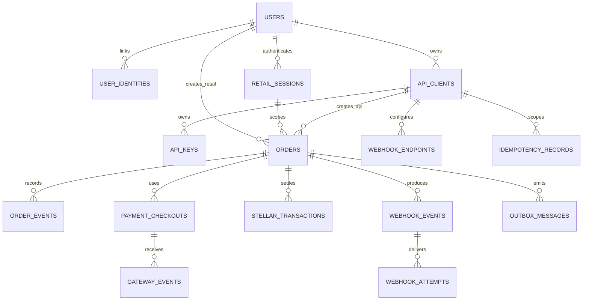

# Database Design

## 1. Database principles

- PostgreSQL is the authoritative local state store.
- Use migrations; never rely on ORM auto-sync in shared environments.
- Use `timestamptz` in UTC and database-generated/default timestamps where appropriate.
- Monetary and asset values use exact types (`bigint` minor units or constrained `numeric`), never floating point.
- Public IDs use UUID v7/ULID-compatible values; internal sequence IDs are optional but never exposed.
- Foreign keys, unique constraints, and check constraints enforce invariants in addition to application validation.
- Store normalized provider data and minimal sanitized metadata, not unrestricted raw callback payloads.

## 2. Logical schema

## 3. Core tables

### `users`

| Column | Type | Notes |
|---|---|---|
| `id` | `uuid` | Primary key |
| `status` | `text` | `active`, `disabled` |
| `display_name` | `text` | Required display value |
| `email` | `text` | Nullable profile/contact value; never the identity key |
| `avatar_object_key` | `text` | Nullable private MinIO object key; never a public URL or image bytes |
| `email_verified_at` | `timestamptz` | Nullable; copied from the identity provider after verified login |
| `developer_enabled_at` | `timestamptz` | Nullable opt-in timestamp for developer-management access |
| `created_at`, `updated_at` | `timestamptz` | UTC |

One local user can act through retail sessions, opt into Developer Mode, or receive separately controlled internal operator access. Auth0 proves the external identity; KailoPay stores the stable provider subject separately and owns local authorization. Email is profile data and is not used as the identity key.

### `user_identities`

| Column | Type | Notes |
|---|---|---|
| `id` | `uuid` | Primary key |
| `user_id` | `uuid` | FK to `users` |
| `provider` | `text` | `auth0` for `v0.1.0` |
| `subject` | `text` | Stable provider subject, such as Auth0 `sub`; never an email address |
| `created_at` | `timestamptz` | UTC |
| `last_login_at` | `timestamptz` | Nullable UTC timestamp |

Unique: `(provider, subject)`. This permits future account linking without changing the local user ID and prevents duplicate local users for one provider identity.

### `retail_sessions`

| Column | Type | Notes |
|---|---|---|
| `id` | `uuid` | Primary key |
| `user_id` | `uuid` | FK to `users` |
| `token_hash` | `bytea` | High-entropy session token hash; plaintext never persisted |
| `expires_at` | `timestamptz` | Required expiry |
| `last_used_at`, `revoked_at` | `timestamptz` | Nullable activity/revocation timestamps |
| `created_at`, `updated_at` | `timestamptz` | UTC |

Unique: `token_hash`. Retail sessions are short-lived, revocable, and scoped to the user’s own orders.

### `api_clients`

| Column | Type | Notes |
|---|---|---|
| `id` | `uuid` | Primary key |
| `owner_user_id` | `uuid` | Non-null FK to the directly owning `users` record |
| `name` | `text` | Display name |
| `environment` | `text` | Check: `test` for `v0.1.0` |
| `status` | `text` | `active`, `revoked` |
| `created_at`, `updated_at` | `timestamptz` | UTC |

### `api_keys`

| Column | Type | Notes |
|---|---|---|
| `id` | `uuid` | Internal key record ID |
| `client_id` | `uuid` | FK to `api_clients` |
| `public_id` | `text` | Unique lookup component embedded in key |
| `prefix` | `text` | Safe display prefix only |
| `secret_hash` | `bytea` or `text` | Hash/HMAC result; never plaintext |
| `created_at`, `last_used_at`, `revoked_at` | `timestamptz` | Nullable activity/revocation timestamps |

Recommended key format: `pk_test_<public_id>_<random_secret>`. Parse `public_id` for indexed lookup, then constant-time verify the secret against the stored hash.

### `orders`

| Column | Type | Notes |
|---|---|---|
| `id` | `uuid` | Public order ID |
| `client_id` | `uuid` | Nullable FK for API-created orders |
| `created_by_user_id` | `uuid` | Nullable actor/correlation user FK |
| `retail_session_id` | `uuid` | Nullable FK for retail-created orders |
| `direction` | `text` | `onramp`, `offramp` |
| `status` | `text` | State-machine value |
| `version` | `integer` | Optimistic concurrency |
| `currency` | `text` | `IDR` |
| `fiat_amount_minor` | `bigint` | Positive check |
| `asset_code`, `asset_issuer`, `network` | `text` | Network check: testnet |
| `asset_amount` | `numeric(p,s)` or canonical string mapping | Precision configured for asset |
| `payment_method`, `gateway_provider` | `text` | Supported enum/configuration |
| `stellar_source`, `stellar_destination`, `stellar_memo` | `text` | Nullable by direction/stage |
| `withdrawal_destination` | encrypted/minimized structured column | Synthetic sandbox data only |
| `expires_at` | `timestamptz` | Optional lifecycle expiry |
| `failure_code`, `failure_stage`, `failure_retryable` | typed columns | Safe public/operational data |
| `created_at`, `updated_at`, `completed_at` | `timestamptz` | UTC |

Use explicit check constraints for positive amounts, supported directions, network, terminal timestamps, and exactly one ownership route:

- API route: `client_id` is non-null; `retail_session_id` is null. Developer-dashboard access resolves the owner through `api_clients.owner_user_id`.
- Retail route: `created_by_user_id` and `retail_session_id` are non-null; `client_id` is null.

The application may retain `created_by_user_id` for an API order initiated from a developer session, but public API authorization is based on the API client.

### `order_events`

| Column | Type | Notes |
|---|---|---|
| `id` | `uuid` | Event ID |
| `order_id` | `uuid` | FK |
| `aggregate_version` | `integer` | Unique with order ID |
| `event_type` | `text` | Stable internal name |
| `previous_status`, `new_status` | `text` | Nullable where not a transition |
| `source` | `text` | API/callback/worker/reconciliation/operator |
| `correlation_id` | `text` | Trace across processes |
| `metadata` | `jsonb` | Sanitized, versioned shape |
| `created_at` | `timestamptz` | Immutable |

Unique: `(order_id, aggregate_version)`.

### `payment_checkouts`

Columns include ID, order ID, provider, provider checkout ID, method, expected currency/amount, status, checkout/QR presentation reference, expiry, sanitized metadata, and timestamps.

Unique: `(provider, provider_checkout_id)`. Index: `(order_id, created_at)`.

### `gateway_events`

Columns include ID, provider, provider event ID or deterministic fingerprint, event type, checkout/order reference, payload hash, signature/authentication result, matching result, received/processed timestamps, processing status, and safe error.

Unique: `(provider, provider_event_id)` when provided; otherwise `(provider, payload_hash, event_type)` with a documented collision strategy.

### `stellar_transactions`

Columns include ID, order ID, stable intent ID, purpose, network, asset, amount, source, destination, memo, transaction hash, status (`pending`, `submitted`, `confirmed`, `failed`, `unknown`), attempt count, ledger/created-at time, last safe error, and timestamps.

Unique constraints:

- `(order_id, purpose)` for single-effect purposes in `v0.1.0`.
- `transaction_hash` when non-null.
- `intent_id`.

### `webhook_endpoints`

Columns include ID, non-null client ID, URL, status, encrypted secret/secret reference, subscribed event types, created/updated/disabled timestamps. Developer-session management verifies ownership through `api_clients.owner_user_id`.

URLs must pass SSRF policy validation before activation.

### `webhook_events`

Columns include ID, order ID, event type, API version, canonical payload JSON, creation timestamp, and optional source order-event ID.

### `webhook_attempts`

Columns include ID, event ID, endpoint ID, attempt number, status, scheduled/started/completed timestamps, HTTP status, duration, response-body hash/truncated safe diagnostic, safe error, and next-attempt time.

Unique: `(event_id, endpoint_id, attempt_number)`.

### `idempotency_records`

Columns include client ID, operation, idempotency-key hash, request hash, response status/body or created resource ID, state (`processing`, `completed`, `failed`), expiry, and timestamps.

Unique: `(client_id, operation, idempotency_key_hash)`.

Conflicting request hashes return `409 IDEMPOTENCY_KEY_REUSED`.

### `outbox_messages`

Columns include ID, topic/type, aggregate type/ID, payload JSON, created time, available time, lease owner/until, attempts, processed time, and last safe error.

Index unprocessed messages by `(processed_at, available_at)` and use atomic leasing.

## 4. Transaction boundaries

One transaction must cover:

- Current aggregate update with optimistic version check.
- Immutable order event insertion.
- New outbox message insertion.
- Idempotency-record completion when handling an idempotent API command.

External network calls must occur outside long-running database transactions. Persist intent first, commit, then process asynchronously.

## 5. Index plan

Minimum indexes:

- `user_identities(provider, subject)` unique for external identity lookup.
- `user_identities(user_id)` for local-user identity management.
- `retail_sessions(token_hash)` unique for session authentication.
- `api_clients(owner_user_id, created_at desc)` for developer-management listing.
- `orders(client_id, created_at desc)` for API-client listing.
- `orders(retail_session_id, created_at desc)` for retail history.
- `orders(status, updated_at)` for reconciliation/operations.
- `orders(gateway_provider, payment_method)` if operational lookup requires it.
- `order_events(order_id, aggregate_version)` unique.
- Provider-reference indexes on payment and gateway tables.
- `stellar_transactions(order_id, purpose)` and unique non-null hash.
- `webhook_attempts(status, scheduled_at)` for delivery worker.
- `outbox_messages(processed_at, available_at)` partial where unprocessed.
- `idempotency_records(expires_at)` for retention cleanup.

Review client-owner and session indexes with representative data before adding broader search indexes.

Confirm indexes using real query plans after representative sandbox data exists; do not add speculative indexes blindly.

## 6. Migration strategy

- Use immutable, ordered migration files.
- Backward-compatible schema changes precede code that depends on them.
- Destructive migration is prohibited in the 30-day review environment without a tested backup and explicit approval.
- CI applies all migrations to an empty database and runs integration tests.
- Deployment runs migrations once before new API/worker processes become ready.
- Seed scripts create only synthetic demo clients/assets and never production-like credentials.

## 7. Retention and cleanup

Sandbox cleanup jobs may expire:

- Idempotency records after the documented retry window.
- Old delivery diagnostics after evidence retention requirements are satisfied.
- Synthetic demo orders only after the Ambassador review window and evidence archive are complete.

Do not cascade-delete audit/evidence unexpectedly. Production retention policy is Future scope.

## 8. Backup and restore

Before final evidence collection:

- Produce a database backup using the selected hosting mechanism.
- Record release version and migration version.
- Perform at least one restore verification in a non-public environment when feasible.
- Document RPO/RTO as sandbox targets, not production guarantees.

## 9. Database acceptance checks

- Duplicate gateway event/reference insertion is rejected or returns the prior processed result.
- Duplicate Stellar purpose for the same order cannot create a second settlement intent.
- A retail session cannot read an order owned by another session or an API client.
- An authenticated developer cannot manage an API client, key, endpoint, or order owned by another user.
- An API client cannot read an order owned by another API client.
- An order cannot satisfy both the API and retail ownership routes.
- Illegal amounts, directions, networks, and aggregate versions fail safely.
- Order update, order event, and outbox insert commit or roll back together.
- API keys cannot be reconstructed from stored values.
- Database dumps and diagnostic queries do not contain private keys or full API-key plaintext.
