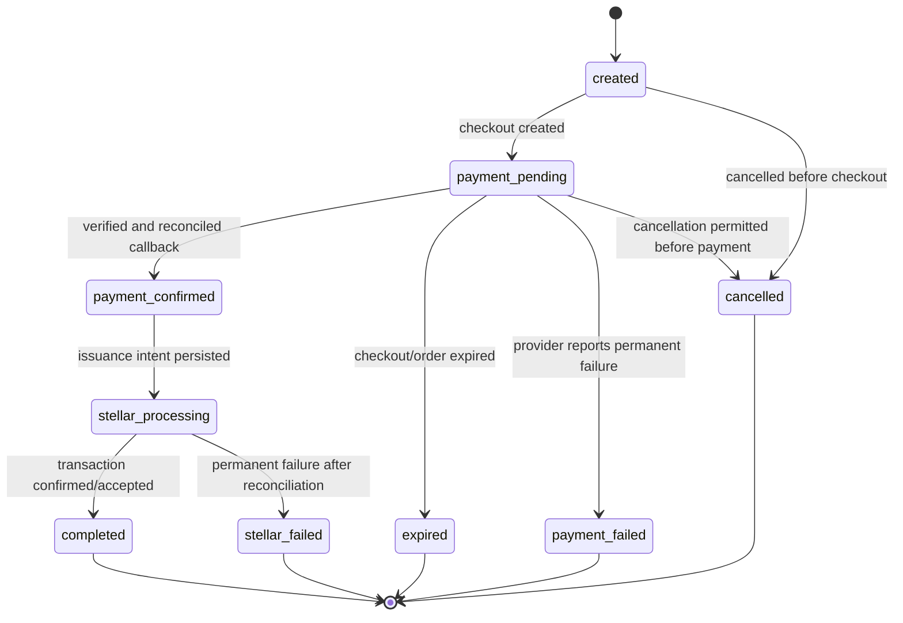
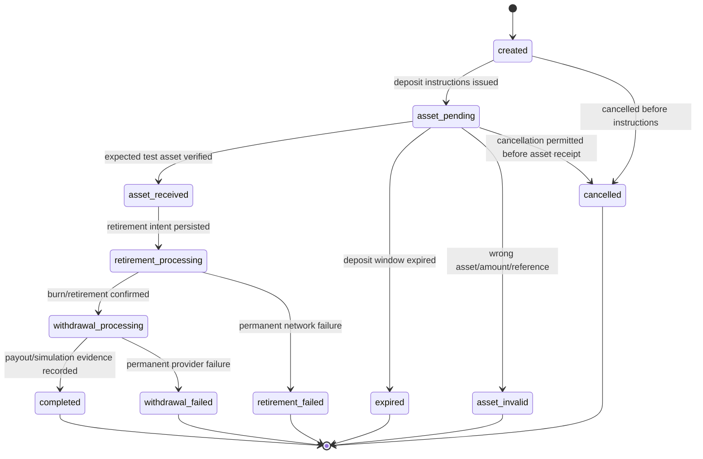

# Order State Machines

## 1. General rules

- State transitions occur only through the order application service.
- Every accepted transition increments the aggregate version and appends an order event in the same database transaction.
- Reprocessing the same external fact returns the existing result without repeating an external effect.
- Terminal states are immutable in `v0.1.0`.
- `failed` states retain the failed stage and retryability; a recoverable external failure is not automatically a terminal business failure.
- Public state names are stable API contract values. Internal job states may be more detailed.

## 2. On-ramp state machine

### On-ramp transition table

| From | Event/command | Guard | To | Durable evidence |
|---|---|---|---|---|
| `created` | Checkout created | Provider reference and expected amount stored | `payment_pending` | Checkout ID, method, expiry |
| `payment_pending` | Payment confirmed | Callback authentic, event unique, currency/amount/reference match | `payment_confirmed` | Provider event and payment reference |
| `payment_pending` | Expire order | Server time past expiry and no accepted payment | `expired` | Expiry event |
| `payment_pending` | Payment failed | Verified permanent provider outcome | `payment_failed` | Safe provider failure code |
| `payment_confirmed` | Queue issuance | No existing issuance intent | `stellar_processing` | Stellar intent and outbox row |
| `stellar_processing` | Settlement confirmed | Transaction hash and successful network result recorded | `completed` | Stellar transaction hash |
| `stellar_processing` | Settlement failed | Permanent result established after network reconciliation | `stellar_failed` | Attempts and final safe error |

Late payment after expiry is an exception requiring reconciliation. It must not silently issue assets; record it for manual sandbox resolution and disclose it in the runbook.

## 3. Off-ramp state machine

### Off-ramp transition table

| From | Event/command | Guard | To | Durable evidence |
|---|---|---|---|---|
| `created` | Deposit instructions issued | Processing account, asset, amount, memo/reference stored | `asset_pending` | Deposit instruction record |
| `asset_pending` | Asset received | Testnet transaction successful; asset, issuer, amount, destination, memo match | `asset_received` | Deposit transaction hash |
| `asset_pending` | Expire order | Deposit window passed and no matching asset received | `expired` | Expiry event |
| `asset_pending` | Invalid deposit established | A correlated deposit exists but violates required asset/amount rules | `asset_invalid` | Transaction hash and safe mismatch reason |
| `asset_received` | Queue retirement | No existing retirement intent | `retirement_processing` | Retirement intent and outbox row |
| `retirement_processing` | Retirement confirmed | Burn/retirement transaction is successful | `withdrawal_processing` | Retirement transaction hash and payout intent |
| `retirement_processing` | Retirement failed | Permanent result established after reconciliation | `retirement_failed` | Attempts and final safe error |
| `withdrawal_processing` | Withdrawal completed | Gateway sandbox reference or approved simulation evidence stored | `completed` | Payout/simulation reference |
| `withdrawal_processing` | Withdrawal failed | Verified permanent provider outcome | `withdrawal_failed` | Safe provider failure code |

## 4. Unknown external outcomes

Timeout is not proof of failure. When a provider or Stellar submission returns an unknown outcome:

1. Persist the intent and attempt as `unknown`.
2. Keep the order in its processing state.
3. Query the external system using stable idempotency/reference data.
4. Apply success if evidence exists.
5. Retry only when the external system confirms no previous success or the operation is safely idempotent.
6. Escalate after the bounded reconciliation window rather than looping indefinitely.

## 5. Concurrency control

- Update an order with `WHERE id = ? AND version = ?`; zero affected rows means a concurrent modification conflict.
- External event IDs have unique database constraints.
- One active settlement intent per order and purpose is enforced by a unique constraint.
- Workers lease jobs using `FOR UPDATE SKIP LOCKED` or equivalent atomic leasing.
- API idempotency response creation and order creation occur in one transaction.

## 6. Public versus internal status

The public API may expose the states above plus a safe `failure` object. Internal tables may track checkout, callback, job, transaction, and delivery statuses independently.

Do not expose:

- Raw provider error bodies.
- Private operational retry counters unless documented.
- Secret-bearing request data.
- A success status before required external evidence is durable.

## 7. State transition tests

Every legal transition requires:

- Happy-path test.
- Invalid predecessor-state test.
- Duplicate event/command test.
- Concurrent version-conflict test where relevant.
- Persistence rollback test when event/outbox write fails.
- Public state/error mapping test.

Every state must have a documented route to a terminal outcome or an operator escalation procedure.
